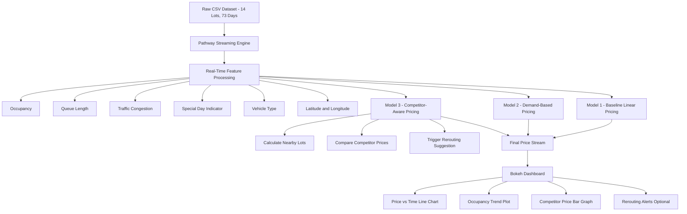

# 🚗 Dynamic Pricing for Urban Parking Lots

**Capstone Project - Summer Analytics 2025**  
_Consulting & Analytics Club × Pathway_

---

## 📌 Overview

Urban parking lots experience fluctuating demand throughout the day. Static pricing leads to inefficiencies: overuse during peak hours and underutilization in low-demand periods.

This project introduces a **dynamic, real-time pricing engine** for 14 parking lots using:

- **Python**
- **Pandas & NumPy** for pricing logic
- **Pathway** for streaming simulation
- **Bokeh** for real-time dashboards

---

## 🛠 Tech Stack

- **Python 3**
- **NumPy & Pandas** — Data processing & pricing computation
- **Pathway** — Real-time streaming data simulation
- **Bokeh** — Interactive dashboards
- **Geopy** — Haversine distance-based rerouting logic

---

## 📊 Architecture Diagram

---

## 🔄 Project Workflow

### 🧹 Data Preparation

* Parking data from 14 lots.
* Sorted by `Timestamp` and `SystemCodeNumber`.

### ⏱ Real-Time Simulation

* Pathway simulates the data stream at **30-minute intervals** over **73 days**.
* Each record simulates an incoming vehicle with:

  * Type (Car, Bike, Truck)
  * Traffic status
  * Queue length
  * Nearby events
  * SystemCode metadata

---

## 🧠 Pricing Logic

### Model 1: **Baseline Linear Pricing**

* Simple linear function based on occupancy ratio.

### Model 2: **Demand-Based Pricing**

* Dynamic score considering:

  * Occupancy
  * Queue length
  * Traffic conditions
  * Special events
  * Vehicle type

### Model 3: **Competitor-Aware Pricing**

* Adds:

  * Nearby lot price comparison
  * **Rerouting logic** if the lot is full

---

## 🔁 Rerouting Logic

* When a parking lot reaches capacity:

  * Uses **Haversine distance** to find nearby alternatives.
  * Ranks alternatives based on **distance** and **price advantage**.
  * Suggests best rerouting options in real-time.

---

## 📈 Real-Time Dashboard (via Bokeh)

* 📉 **Dynamic Price vs Time** for each parking lot
* 📊 **Competitor Price Bar Plot** at the current timestamp
* 🚦 **Occupancy Trend Line Chart**
* 🔁 Rerouting suggestion log

---

## 📊 Results Summary

* Pricing stays smooth and bounded: **\$5 to \$20**
* Truck > Car > Bike pricing due to weight-based adjustment
* **Traffic congestion** and **local events** significantly impact prices
* Competitor-aware rerouting **reduces overflows** and improves lot utilization

